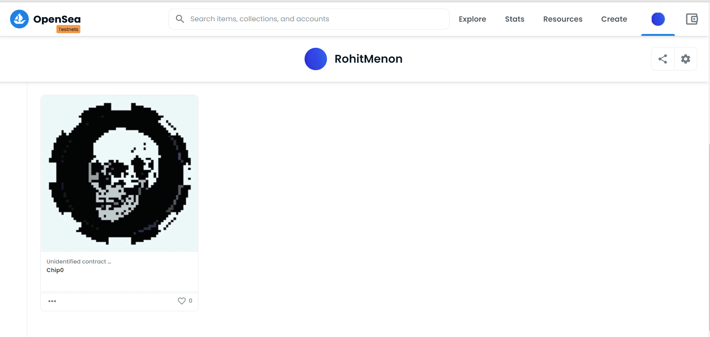

# EthereumNFT

**EthereumNFT ** Creating NFTs on the Ethereum blockchain

Time spent: **10** hours spent in total

## User Stories

The following **required** functionality is completed:

- [x] Minted Chip0 NFT using Rinkeby Testnet
  - [x] Used truffle to deploy contract
  - [x] Deployed NFT to testnet blockchain
  - [x] NFT viewable through OpenSea
  
## Final Output

Here's a image of implemented user stories:

## Notes
Chip0 contract address on rinkeby : 0x75D496ccFF799F49F4C7d69473d095070E0dE6FB

## Open-source libraries used

- [Truffle]
- [OpenZeppelin]

## License

    Copyright [yyyy] [name of copyright owner]

    Licensed under the Apache License, Version 2.0 (the "License");
    you may not use this file except in compliance with the License.
    You may obtain a copy of the License at

        http://www.apache.org/licenses/LICENSE-2.0

    Unless required by applicable law or agreed to in writing, software
    distributed under the License is distributed on an "AS IS" BASIS,
    WITHOUT WARRANTIES OR CONDITIONS OF ANY KIND, either express or implied.
    See the License for the specific language governing permissions and
    limitations under the License.
